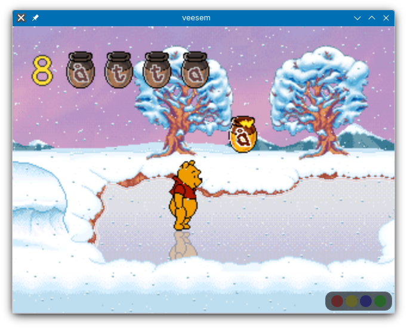
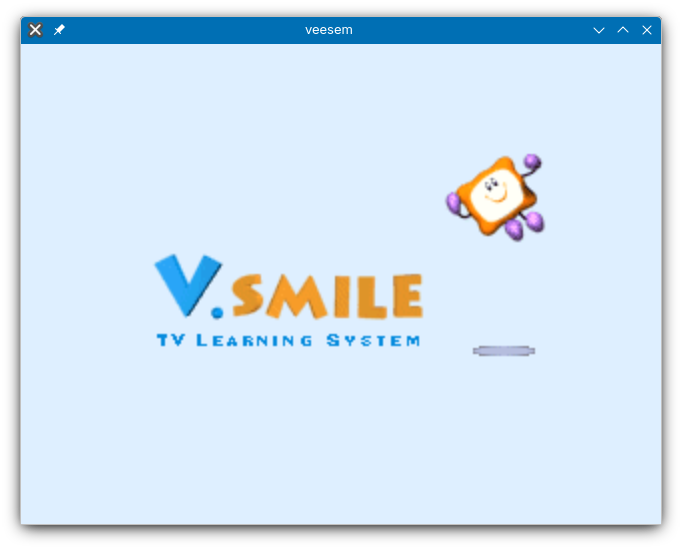

# veesem 

veesem is an experimental V.Smile emulator. Game compatibility is generally quite good from what I have tested so far, though more features, a more advanced UI and better accuracy are future targets.

## Command line options

* Usage: `veesem [OPTIONS] CARTROM`
* Emulation options:
    * `-sysrom ROM` - Provide system ROM (otherwise dummy ROM without boot animation will be used)
    * `-pal` - Use PAL video timing (default)
    * `-ntsc` - Use NTSC video timing
    * `-art` - Emulate CSB2 cartridge NVRAM (used by V.Smile Art Studio)
    * `-art-nvram FILE` - Emulate CSB2 cartridge NVRAM and use `FILE` for persistent saving
    * `-region NUM` - Set jumpers configuring system ROM region as hex number in range 0-f
    * `-novtech` - Set jumper disabling VTech logo in system ROM intro
* Visual options:
    * `-leds` - Show controller LEDs at startup
    * `-fps` - Show emulation FPS at startup

## Controls

Currently only the standard V.Smile controller is supported.

| V.Smile  | Keyboard   | Gamepad (Xbox/SDL_GameController) |
| ------   | --------   | ----------------------------------|
| Enter    | Space      | A                                 |
| Help     | A          | B                                 |
| Back     | S          | Start                             |
| ABC      | D          | Select/Back                       |
| Red      | Z          | X                                 |
| Yellow   | X          | Y                                 |
| Blue     | C          | RB                                |
| Green    | V          | LB                                |
| Joystick | Arrow keys | D-pad or left analog stick

### Keyboard shortcuts

| Key        | Action                                |
| ---------- | ------------------------------------- |
| Esc        | Exit veesem                           |
| Tab (hold) | Unlock framerate                      |
| F1         | Simulate console ON button press      |
| F2         | Simulate console OFF button press     |
| F3         | Simulate console RESTART button press |
| F11        | Toggle fullscreen                     |

## Build instructions

* Required dependencies: SDL2, OpenGL, CMake (for building)
* Supported compilers: GCC or Clang with C++20 support. MSVC is not supported.

### Steps
1. Create a `build` directory and change working directory to it.
2. Run `cmake .. -DCMAKE_BUILD_TYPE=Release`.
    - ⚠️ If you do not specify `-DCMAKE_BUILD_TYPE=Release` and have no optimizing flags
      defined in the `CXXFLAGS` environment variable, the emulation speed of your
      build will be significantly slower and may lag frequently.
    - When building on Windows, you may need to specify the path of your SDL2
      MinGW development package directory with `-DCMAKE_MODULE_PATH`,
      e.g. `-DCMAKE_MODULE_PATH=~/SDL2-2.30.11/x86_64-w64-mingw32/`.
3. Run `cmake --build .`. Add `-j` flag followed by number of threads for parallel building.
4. You should now have a working `veesem` executable.
    - For Windows, remember to also copy the DLL from the SDL2 development package
      directory to the directory of the executable.
      The DLL can usually be found in `x86_64-w64-mingw32/bin`.
5. Optionally, you can install it into your system with `cmake --install .`.
